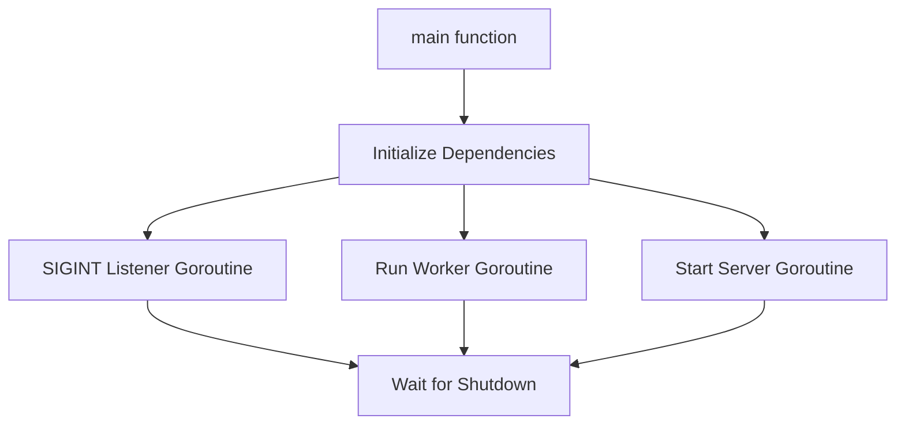

## PR Review Processing Flow (Redis + Asynq + Worker)

```mermaid
flowchart LR
    A[GitHub Webhook (PR Open/Update)] --> B[HTTP Server (API)]
    B --> C[Redis (Asynq DB)]
    C --> D[Asynq Worker]
    D --> E[AI Review Engine (LLM-based)]
    E --> F[GitHub API (Post Comments)]

    subgraph "HTTP Server (API)"
        B1[Validates Webhook]
        B2[Enqueues Task (Asynq)]
    end
    B --> B1
    B1 --> B2
    B2 --> C

    subgraph "Asynq Worker"
        D1[Dequeues Task]
        D2[Fetches PR Diff]
        D3[Builds Prompt]
        D4[Calls AI API]
        D5[Posts Comments]
    end
    D --> D1 --> D2 --> D3 --> D4 --> D5 --> F

```

+----------------------+ +------------------------+ +------------------+
| GitHub Webhook | -----> | HTTP Server (API) | | AI Review |
| (PR Open/Update) | | - Validates Webhook | | Generator (LLM)|
+----------------------+ | - Enqueues Task (Asynq)| +------------------+
+------------------------+
|
v
+------------------+
| Redis (Asynq DB)|
| - Stores Queued |
| Tasks |
+------------------+
|
v
+-----------------------------+
| Asynq Worker (Goroutine) |
| - Dequeues Task |
| - Fetches PR Diff |
| - Builds Prompt |
| - Calls AI API |
| - Posts Comments via GitHub |
+-----------------------------+

## Understand graceful shutdown of services



┌──────────────┐
│ main() │
└────┬─────────┘
│
├─ initializeDependencies()
├─ signal listener goroutine ───┐
├─ RunWorker() goroutine │ (listens for ctx cancel)
├─ startServer() goroutine │ (listens for ctx cancel)
└─ wg.Wait() <──────────────────┘ waits for both
