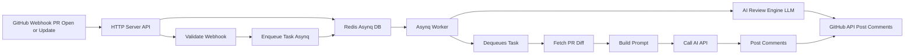
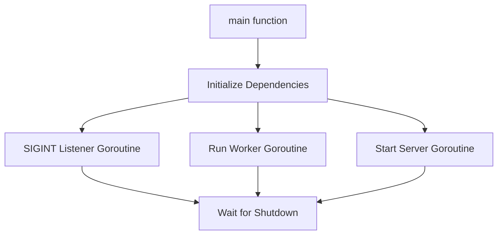

## PR Review Processing Flow (Redis + Asynq + Worker)

+----------------------+ +------------------------+ +------------------+
| GitHub Webhook | -----> | HTTP Server (API) | | AI Review |
| (PR Open/Update) | | - Validates Webhook | | Generator (LLM)|
+----------------------+ | - Enqueues Task (Asynq)| +------------------+
+------------------------+
|
v
+------------------+
| Redis (Asynq DB)|
| - Stores Queued |
| Tasks |
+------------------+
|
v
+-----------------------------+
| Asynq Worker (Goroutine) |
| - Dequeues Task |
| - Fetches PR Diff |
| - Builds Prompt |
| - Calls AI API |
| - Posts Comments via GitHub |
+-----------------------------+

## Understand graceful shutdown of services

┌──────────────┐
│ main() │
└────┬─────────┘
│
├─ initializeDependencies()
├─ signal listener goroutine ───┐
├─ RunWorker() goroutine │ (listens for ctx cancel)
├─ startServer() goroutine │ (listens for ctx cancel)
└─ wg.Wait() <──────────────────┘ waits for both
